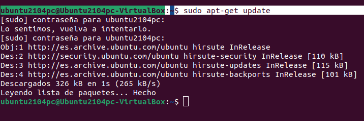
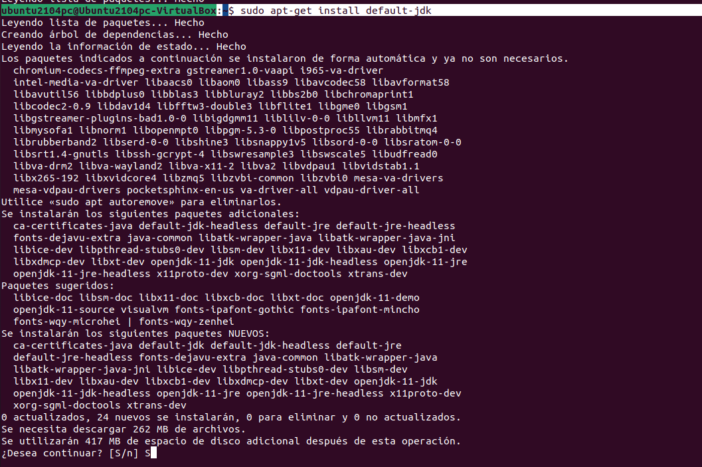
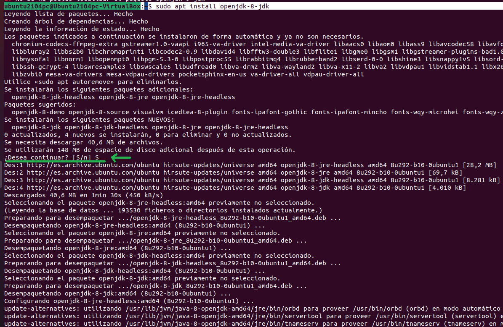
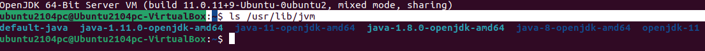
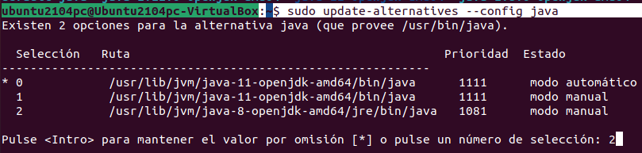
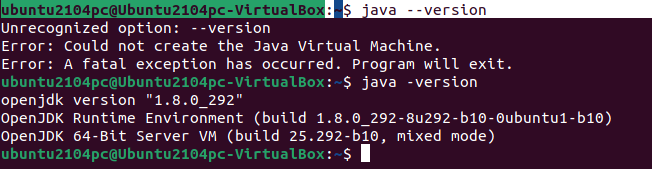

# Instalación de JDK en Ubuntu

## 1.Instalar Java:
Primero hay que actualizar el sistema:

```console
sudo apt-get update
```



Segundo se instala Java:

```console
sudo apt-get install default-jdk
```



Comprobamos que lo tenemos instalado con lo siguiente:

```console
java --version
```


## 2.Instalar los JDK

Para instalar Ubuntu Java Open JDK ("la que utilizaremos en 1º").
 - OpenJDK:

   - 11 (ya lo instalamos en el paso de instalar Java)


   ```
   sudo apt install openjdk-11-jdk
   ```
   
    - 9 (Ya no está soportado)
    
   ```
   sudo apt install openjdk-9-jdk
   ```
   
   
   
    - 8
    
   ```
   sudo apt install openjdk-8-jdk
   ```
   
   
   
   
   
   
   
 Mostraremos la 8 Para ello verificaremos la versión de java que se esta ejecutando con la sentencia:

```console 
java --version
```


En caso que no se ejecuta la versión 8 se debe configurar las variables de entorno.

## Configuración de las variables de entorno
### Listar la versiones de OpenJDK instaladas
 Ejecuta el siguiente comando para verificar que se han descargado las diferentes versiones de OpenJDK.

```console 
ls /usr/lib/jvm
```



### Actualización de las variables de entorno

 Edita y modifica el fichero profile, con los comandos:

```console 
sudo update-alternatives --config java
```



 y selecciona la version _8_, cuyo valor es __java-1.8.0-openjdk-amd64__.

Comprobamos que tenemos la versión 8 con java -version (java --version no funciona en esta versión del jdk):

```console
java -version
```


